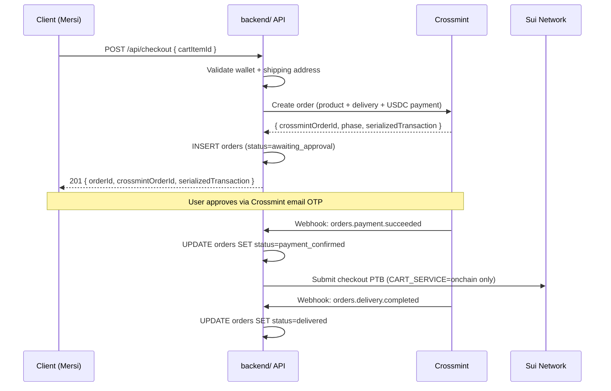

<Callout type="warn">
Requires a valid `crossmint-jwt` cookie and completed onboarding. The user must have an active EVM wallet and a complete shipping address. Rate-limited at 30 req/min per user.
</Callout>

## POST /api/checkout

Creates a Crossmint payment order for a single cart item. On success, records the order in the database with `status = awaiting_approval` and returns details needed for the approval flow.

**Auth required:** Yes + onboarding complete

### Request Body

| Field | Type | Required | Description |
|---|---|---|---|
| `cartItemId` | UUID | Yes | ID of the cart item to purchase |

```json
{ "cartItemId": "c1d2e3f4-a5b6-7890-cdef-123456789012" }
```

### Response `201 Created`

```json
{
  "orderId": "d1e2f3a4-b5c6-7890-defg-234567890123",
  "crossmintOrderId": "ed34a579-7fbc-4509-b8d8-9e61954cd555",
  "phase": "awaiting-approval",
  "serializedTransaction": "0x02f901...",
  "walletAddress": "0xDeAdBeEf00000000000000000000000000000001"
}
```

| Field | Type | Description |
|---|---|---|
| `orderId` | UUID | Internal order ID for tracking via `GET /api/orders/:orderId` |
| `crossmintOrderId` | string | Crossmint's order reference |
| `phase` | string | Initial phase from Crossmint (e.g. `awaiting-approval`) |
| `serializedTransaction` | string | Pre-built EVM transaction for Crossmint wallet approval |
| `walletAddress` | string | EVM wallet address that must approve the transaction |

### Errors

| Status | Code | Cause |
|---|---|---|
| 400 | `CheckoutNoWalletError` | User's EVM wallet is not provisioned |
| 400 | `CheckoutMissingAddressError` | Shipping address is incomplete |
| 404 | `CartItemNotFoundError` | Cart item does not exist or belongs to another user |
| 422 | `InsufficientFundsError` | Crossmint wallet has insufficient USDC |
| 502 | `CheckoutOrderCreationError` | Crossmint API error creating the order |
| 502 | `CheckoutPaymentError` | Crossmint API payment error |

### curl Example

```bash
curl -b cookies.txt -X POST http://localhost:3000/api/checkout \
  -H "Content-Type: application/json" \
  -d '{"cartItemId":"c1d2e3f4-a5b6-7890-cdef-123456789012"}'
```

---

## Checkout Flow



## On-Chain Checkout (CART_SERVICE=onchain)

When the on-chain cart is enabled, payment confirmation triggers a Sui Programmable Transaction Block (PTB) that marks the item as purchased in the Move contract:

1. **Webhook-triggered** — When Crossmint fires `orders.payment.succeeded` or `orders.delivery.completed`, the backend constructs and submits a PTB calling `checkout` on the Move contract.
2. The resulting Sui digest is saved to `orders.tx_hash`.
3. This step is non-fatal — if the PTB fails, the order status is still updated but the on-chain state may diverge.
