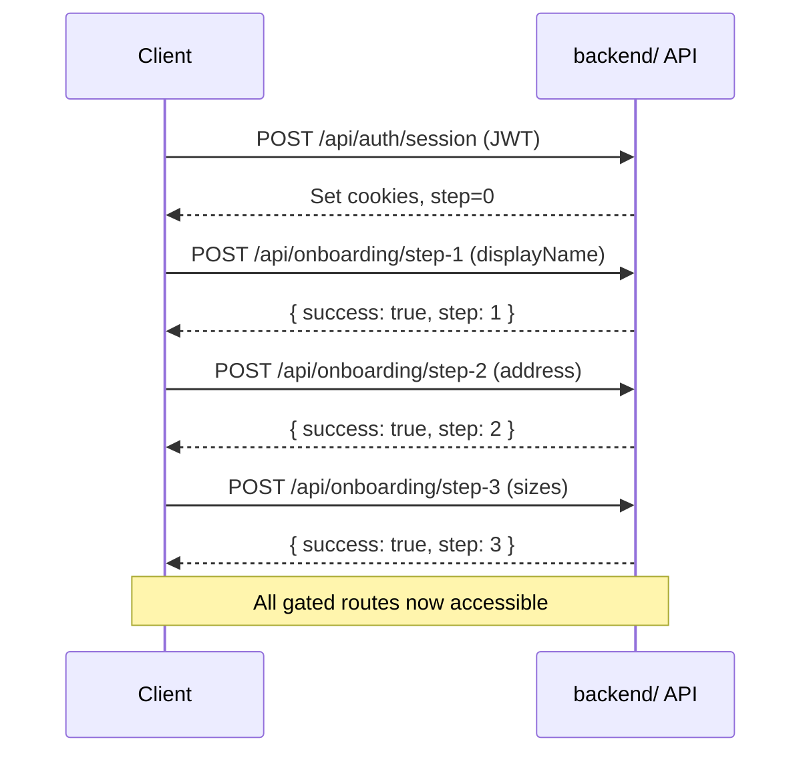

New users must complete all three onboarding steps before accessing chat, cart, checkout, and orders. Progress is tracked in `users.onboarding_step` (0–3).

<Callout type="info">
Onboarding routes require a valid JWT cookie but do **not** require onboarding to be complete. They are rate-limited at 30 req/min per IP.
</Callout>

## Allowed Countries

Step 2 accepts only the following `country` values: `US`, `GB`, `AU`, `CA`, `DE`, `FR`, `JP`, `SG`.

## Allowed Tops Sizes

Step 3 `topsSize` must be one of: `XXS`, `XS`, `S`, `M`, `L`, `XL`, `XXL`.

---

## GET /api/onboarding/status

Return the user's current onboarding step.

**Auth required:** Yes

### Response `200 OK`

```json
{
  "step": 1,
  "completed": false
}
```

| Field | Type | Description |
|---|---|---|
| `step` | 0–3 | Completed steps. `3` means fully onboarded. |
| `completed` | boolean | `true` when `step === 3` |

### curl Example

```bash
curl -b cookies.txt http://localhost:3000/api/onboarding/status
```

---

## POST /api/onboarding/step-1

Set the user's display name. Advances `onboarding_step` to at least `1` (uses `GREATEST` — re-submitting never regresses the counter).

**Auth required:** Yes

### Request Body

| Field | Type | Constraints |
|---|---|---|
| `displayName` | string | 1–100 characters |

```json
{ "displayName": "Alex" }
```

### Response `200 OK`

```json
{ "success": true, "step": 1 }
```

### Errors

| Status | Code | Cause |
|---|---|---|
| 400 | `VALIDATION_ERROR` | `displayName` missing or exceeds 100 chars |
| 401 | `UNAUTHORIZED` | Missing JWT cookie |

### curl Example

```bash
curl -b cookies.txt -X POST http://localhost:3000/api/onboarding/step-1 \
  -H "Content-Type: application/json" \
  -d '{"displayName":"Alex"}'
```

---

## POST /api/onboarding/step-2

Set the shipping address. Advances `onboarding_step` to at least `2`. Requires step 1 to be completed first.

**Auth required:** Yes

### Request Body

| Field | Type | Required | Constraints |
|---|---|---|---|
| `firstName` | string | Yes | 1–50 chars |
| `lastName` | string | Yes | 1–50 chars |
| `street` | string | Yes | 5–200 chars |
| `apt` | string | No | max 50 chars |
| `country` | string | Yes | Enum: US, GB, AU, CA, DE, FR, JP, SG |
| `city` | string | Yes | 2–100 chars |
| `state` | string | No | max 100 chars |
| `zip` | string | Yes | 3–20 chars |

```json
{
  "firstName": "Alex",
  "lastName": "Chen",
  "street": "123 Main St",
  "apt": "Apt 4B",
  "country": "US",
  "city": "New York",
  "state": "NY",
  "zip": "10001"
}
```

### Response `200 OK`

```json
{ "success": true, "step": 2 }
```

### Errors

| Status | Code | Cause |
|---|---|---|
| 400 | `VALIDATION_ERROR` | Required field missing or invalid country |
| 403 | `STEP_NOT_REACHED` | Step 1 not completed yet |
| 401 | `UNAUTHORIZED` | Missing JWT cookie |

### curl Example

```bash
curl -b cookies.txt -X POST http://localhost:3000/api/onboarding/step-2 \
  -H "Content-Type: application/json" \
  -d '{"firstName":"Alex","lastName":"Chen","street":"123 Main St","country":"US","city":"New York","zip":"10001"}'
```

---

## POST /api/onboarding/step-3

Set clothing sizes. Sets `onboarding_step` to `3`, completing onboarding. All gated routes become accessible immediately. On first completion, sizes are asynchronously stored in MemWal for AI personalization.

**Auth required:** Yes

### Request Body

| Field | Type | Required | Constraints |
|---|---|---|---|
| `topsSize` | string | Yes | Enum: XXS, XS, S, M, L, XL, XXL |
| `bottomsSize` | string | Yes | 1–10 chars (e.g. `"32"`, `"M"`) |
| `footwearSize` | string | Yes | 1–10 chars (e.g. `"10"`, `"42"`) |

```json
{
  "topsSize": "M",
  "bottomsSize": "32",
  "footwearSize": "10"
}
```

### Response `200 OK`

```json
{ "success": true, "step": 3 }
```

### Errors

| Status | Code | Cause |
|---|---|---|
| 400 | `VALIDATION_ERROR` | Invalid `topsSize` or missing field |
| 403 | `STEP_NOT_REACHED` | Step 2 not completed yet |
| 401 | `UNAUTHORIZED` | Missing JWT cookie |

### curl Example

```bash
curl -b cookies.txt -X POST http://localhost:3000/api/onboarding/step-3 \
  -H "Content-Type: application/json" \
  -d '{"topsSize":"M","bottomsSize":"32","footwearSize":"10"}'
```

---

## Onboarding Flow


