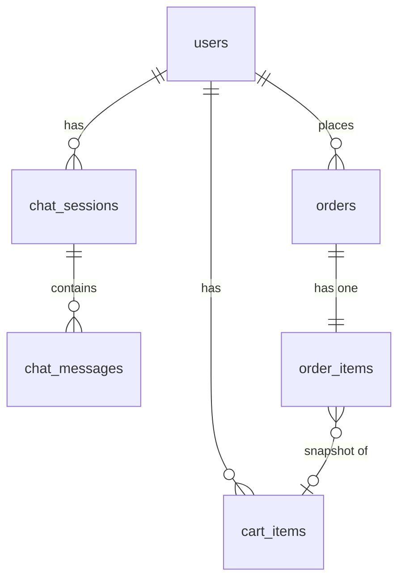

The `backend/` service uses **PostgreSQL** via [Drizzle ORM](https://orm.drizzle.team) and the `postgres.js` driver. All schema is defined as TypeScript in `backend/src/db/schema/`.

## Tables

### `users`

Stores user profiles, wallet addresses, and onboarding progress.

| Column | Type | Notes |
|---|---|---|
| `id` | UUID | Primary key |
| `crossmint_user_id` | varchar(255) | **UNIQUE** — Crossmint identity |
| `email` | varchar(320) | Indexed |
| `wallet_address` | varchar(66) | Sui wallet address (indexed) |
| `crossmint_wallet_id` | varchar(255) | Crossmint wallet reference |
| `wallet_status` | varchar(20) | `none` \| `pending` \| `active` \| `failed` |
| `onboarding_step` | integer | 0–3 |
| `display_name` | varchar(100) | Set in onboarding step 1 |
| `first_name`, `last_name` | varchar(50) | Set in onboarding step 2 |
| `street`, `apt`, `city`, `state`, `zip`, `country` | varchar | Shipping address (step 2) |
| `tops_size`, `bottoms_size`, `footwear_size` | varchar(10) | Sizes (step 3) |
| `evm_address` | varchar(42) | Crossmint-provisioned EVM wallet address |
| `sui_private_key_encrypted` | text | AES-encrypted Sui key (optional) |
| `created_at`, `updated_at` | timestamp | Audit timestamps |

### `chat_sessions`

Chat conversation threads.

| Column | Type | Notes |
|---|---|---|
| `id` | UUID | Primary key |
| `user_id` | UUID | FK → `users.id` (cascade delete) |
| `title` | varchar(100) | Display name — auto-generated on first exchange |
| `created_at`, `updated_at` | timestamp | Both indexed for ordering |

### `chat_messages`

Individual messages within a session.

| Column | Type | Notes |
|---|---|---|
| `id` | UUID | Primary key |
| `session_id` | UUID | FK → `chat_sessions.id` (cascade delete) |
| `msg_id` | varchar(100) | AI SDK `UIMessage.id` |
| `role` | varchar(20) | `user` \| `assistant` \| `system` \| `tool` |
| `parts` | JSONB | `UIMessage.parts[]` array — text, tool-invocation, etc. |
| `created_at` | timestamp | Indexed by `session_id` |

### `cart_items`

Off-chain cart items (active when `CART_SERVICE=db`; also mirrored from Sui events when `onchain`).

| Column | Type | Notes |
|---|---|---|
| `id` | UUID | Primary key |
| `user_id` | UUID | FK → `users.id` (cascade delete) |
| `product_id` | varchar(255) | Retailer-scoped product ID |
| `product_name` | varchar(500) | |
| `price` | integer | In USD cents |
| `image`, `product_url` | varchar(2048) | |
| `size`, `color` | varchar(50) | |
| `retailer` | varchar(255) | |
| `tx_digest` | varchar(255) | Sui tx that added the item (onchain mode) |
| `on_chain_object_id` | varchar(255) | **UNIQUE** — Sui object ID of the cart item |
| `deleted_at` | timestamp (with tz) | Soft delete (null = active) |
| `created_at` | timestamp | |

**Unique constraint:** `(user_id, product_id, size, color) WHERE deleted_at IS NULL` — prevents duplicates in the active cart while allowing re-add after checkout.

### `orders`

Payment orders — both `checkout` and `deposit` types.

| Column | Type | Notes |
|---|---|---|
| `id` | UUID | Primary key |
| `user_id` | UUID | FK → `users.id` (cascade delete) |
| `type` | varchar(20) | `checkout` \| `deposit` |
| `crossmint_order_id` | varchar(255) | **UNIQUE** — Crossmint order reference |
| `status` | varchar(50) | `awaiting_approval` / `payment_confirmed` / `in_progress` / `delivered` / `cancelled` |
| `amount_usdc` | numeric | Total charge in USDC |
| `tx_hash` | varchar(255) | **UNIQUE** — Sui PTB digest (on-chain checkout) or deposit tx |
| `payment_hash` | varchar(255) | EVM payment tx ID from Crossmint webhook |
| `created_at` | timestamp | |

### `order_items`

Product snapshot captured at checkout time. One row per order.

| Column | Type | Notes |
|---|---|---|
| `id` | UUID | Primary key |
| `order_id` | UUID | FK → `orders.id` (cascade delete) |
| `cart_item_id` | UUID | FK → `cart_items.id` (set null on delete) |
| `product_id` | varchar(255) | |
| `product_name` | varchar(500) | |
| `price` | integer | In cents at time of checkout |
| `image`, `product_url` | varchar(2048) | |
| `size`, `color` | varchar(50) | |
| `retailer` | varchar(255) | |
| `on_chain_object_id` | varchar(255) | Sui cart item object ID |
| `created_at` | timestamp | |

## Relationships



## Migrations

Migrations live in `backend/src/db/migrations/` as plain SQL files.

```bash
# Run from the backend/ directory
cd backend

# Generate a new migration from schema changes
bunx drizzle-kit generate

# Apply pending migrations manually
bunx drizzle-kit migrate

# Browse DB in a visual UI
bunx drizzle-kit studio
```

Migration files are named `NNNN_description.sql` and tracked in `meta/_journal.json`. **Never modify existing migration files** — add new ones instead.

## Connection Pools

Two database connections are maintained:

| Client | Config | Usage |
|---|---|---|
| `queryClient` | max 5 connections | All query operations (Drizzle `db`) |
| `migrationClient` | max 1 connection | Migration runner only |

`DATABASE_URL_DIRECT` bypasses PgBouncer for the migration client — required when using Neon's pooler endpoint.
