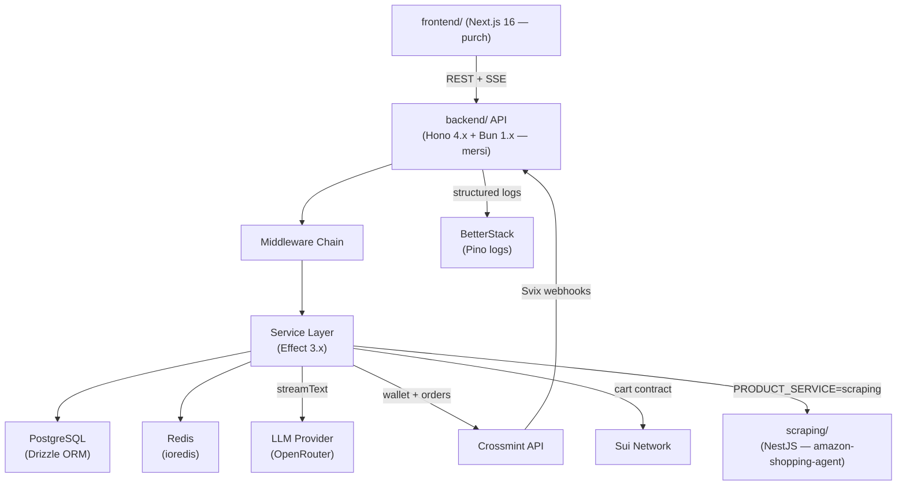
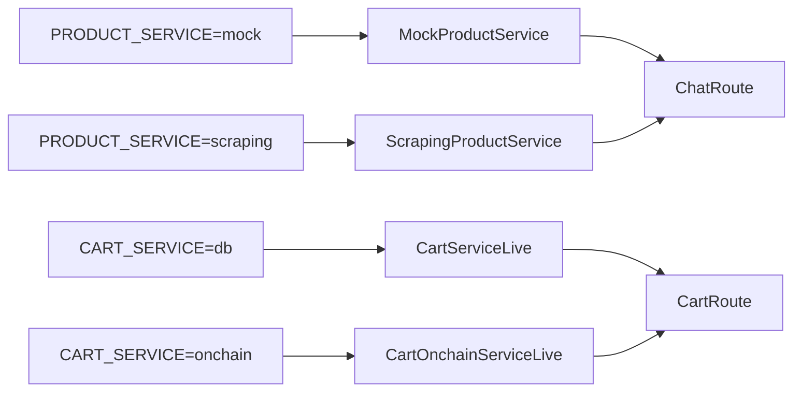

## Component Overview



## Middleware Chain

Every request to `backend/` passes through middleware in this order:

<Steps>
### CORS

Allows specific origins: `localhost:3000`, `localhost:3001`, `localhost:5173`, `localhost:8080`, `null` (file://). Echoes the request origin — never uses wildcard with `credentials: true`.

### Request Logger

Pino-based structured logger. Logs method, path, status, and response time in milliseconds. Errors (5xx) log at `error`, 4xx at `warn`, success at `info`.

### Global Error Handler

Catches any unhandled error and returns a consistent `{ error, code }` JSON envelope. Prevents stack traces from leaking to clients.

### Auth Middleware (`/api/*`)

Validates the `crossmint-jwt` cookie on all protected routes. Skips `/api/auth/session`, `/api/auth/logout`, `/api/dev/*`, and `/api/webhooks/*`.

### Rate Limiter

Applied per route group (see [API Overview](/api)). Default 30 req/min, configurable via `RATE_LIMIT_RPM`.

### Onboarding Gate

Blocks requests to chat, sessions, cart, checkout, and orders if `onboardingStep < 3`. Returns `403 ONBOARDING_INCOMPLETE`.
</Steps>

## Service Selection

Two environment variables in `backend/` switch implementations at startup without changing any route code:



This is implemented via Effect's `Layer` composition in `backend/src/index.ts`:

```typescript
const productServiceLayer =
  env.PRODUCT_SERVICE === "scraping"
    ? ScrapingProductServiceLive.pipe(Layer.provide(CacheServiceLive))
    : MockProductServiceLive

const cartServiceLayer =
  env.CART_SERVICE === "onchain"
    ? CartOnchainServiceLive
    : CartServiceLive.pipe(Layer.provide(CacheServiceLive))
```

## Startup Sequence

When `backend/` starts, it runs in this order:

1. Validate all environment variables via Zod schema (fail fast on missing required vars)
2. Register middleware
3. Mount all routes
4. Start Bun HTTP server on `PORT` (default 3000)
5. Start on-chain event indexer (if `SUI_CONTRACT_ADDRESS` is set)
6. Log a startup summary (port, productService, cartService, nodeEnv)

## Tech Stack Per Service

| Service | Language | Framework | Port |
|---|---|---|---|
| `backend/` | TypeScript (Bun) | Hono 4.x + @hono/zod-openapi | 3000 |
| `frontend/` | TypeScript (Node) | Next.js 16 + React 19 | 3000 (dev) |
| `scraping/` | TypeScript (Node) | NestJS | configurable |
