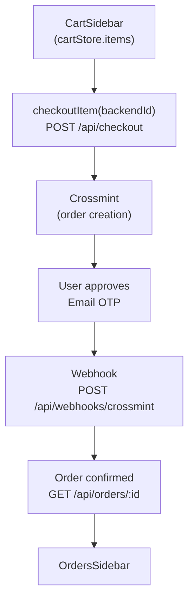

## Cart

### `cartStore` — `lib/cart-store.ts`

Zustand store (no persistence — cart is re-hydrated from the backend on every authenticated page load).

```ts
type CartStore = {
  items: CartItem[]       // { product: Product; backendId?: string }[]
  isOpen: boolean
  add: (product: Product, backendId?: string) => void
  remove: (productId: string) => void
  hydrate: (items: CartItem[]) => void   // merges backend items with pending local items
  setBackendId: (productId: string, backendId: string) => void
  open: () => void
  close: () => void
  reset: () => void
}
```

`backendId` is the UUID assigned by the backend when `POST /api/cart` returns. It is required for `DELETE /api/cart/:id` and `POST /api/checkout` (via `cartItemId`).

### Cart API — `lib/api/cart.ts`

All mutations are **optimistic**: the store is updated before the backend call resolves.

| Method | API call | Notes |
|---|---|---|
| `cartApi.hydrate()` | `GET /api/cart` | Merges backend items into store; pending local items (no `backendId`) are preserved |
| `cartApi.addItem(product)` | `POST /api/cart` | Adds product to store immediately; sets `backendId` from response |
| `cartApi.removeItem(productId)` | `DELETE /api/cart/:backendId` | Removes from store immediately; restores on backend failure |

### `CartHydrator`

`components/ui/CartHydrator` calls `cartApi.hydrate()` once on mount inside the `(main)` layout. This syncs the backend cart (including items added in previous sessions) into the local store.

### `CartSidebar` / `CartPanel`

`CartSidebar` (`components/ui/CartSidebar`) is rendered in the main layout and is controlled by `cartStore.isOpen`. It displays `cartStore.items`, the subtotal, and a checkout button per item. Removing an item calls `cartApi.removeItem`.

## Checkout Flow

<Steps>
### Initiate
User clicks the checkout button for a cart item inside `CartSidebar`. The item's `backendId` is passed to `checkoutItem(cartItemId)` (`lib/api/checkout.ts`).

### Backend creates order
`POST /api/checkout` (60 s timeout) contacts Crossmint, creates an order, and returns a `CheckoutResponse` containing `orderId`, `crossmintOrderId`, `phase`, `serializedTransaction`, and `walletAddress`.

### Email OTP approval
The user receives an email from Crossmint and enters the OTP in a prompt shown by the frontend. Crossmint confirms the transaction server-side.

### Webhook callback
Crossmint fires a webhook to the backend (`POST /api/webhooks/crossmint`), which updates the order's status and phase in the database.

### Order confirmed
The frontend polls `GET /api/orders/:orderId` (or receives an update via `ordersStore`) until the status is terminal. The order appears in `OrdersSidebar`.
</Steps>

<Callout type="warn">
`checkoutItem` has a hard 60-second timeout. If the backend does not respond in time, the UI shows "Checkout request timed out after 60 seconds". Specific error codes (`CheckoutNoWalletError`, `CheckoutMissingAddressError`, `InsufficientFundsError`) are surfaced as user-readable messages.
</Callout>

### `CheckoutResponse` type

```ts
type CheckoutResponse = {
  orderId: string
  crossmintOrderId: string
  phase: string
  serializedTransaction: string
  walletAddress: string
}
```

## Orders

### `ordersStore` — `lib/orders-store.ts`

Lightweight Zustand store that controls the `OrdersSidebar` open/close state. Order data itself is fetched with TanStack Query (see [State Management](/frontend/state)).

```ts
type OrdersStore = { isOpen: boolean; open: () => void; close: () => void; reset: () => void }
```

### Orders API — `lib/api/checkout.ts`

| Function | Call | Description |
|---|---|---|
| `getOrder(orderId)` | `GET /api/orders/:id` | Single order with status |
| `listOrders(params)` | `GET /api/orders` | Paginated list; supports `type`, `phase`, `status` filters |

### `OrdersSidebar` / `OrdersList`

Rendered in the main layout, controlled by `ordersStore.isOpen`. Displays orders returned by `listOrders`, grouped or filtered by status. Each order shows product image, name, price, and the current `status` string (e.g. `payment_confirmed`, `in_progress`, `delivered`).

## Flow Diagram


