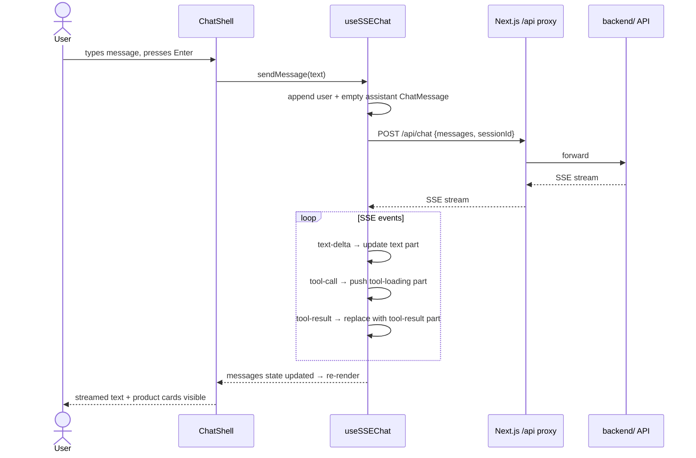

The chat interface streams responses from the `backend/` service using the **AI SDK v6 UI Message Stream** protocol over Server-Sent Events (SSE). The stream delivers text deltas and tool call/result events that are assembled in React state in real time.

## Components

| Component | File | Responsibility |
|---|---|---|
| `ChatShell` | `components/chat/ChatShell` | Outer container: message list, input bar, loading indicator |
| `ChatSidebar` | `components/chat/ChatSidebar` | Session list panel; create/delete/switch sessions |
| `ChatMessage` | `components/chat/ChatMessage` | Renders a single `ChatMessage` with all its `MessagePart`s |
| `ProductDetailSheet` | `components/chat/ProductDetailSheet` | Slide-in sheet opened when the user clicks a product card inside a tool result |

## Message Types

All types are defined in `lib/chat/types.ts`.

```ts
type TextPart            = { type: 'text'; text: string }
type ToolLoadingPart     = { type: 'tool-loading'; toolCallId: string; toolName: string }
type ToolResultPart      = { type: 'tool-result'; toolCallId: string; toolName: string; result: unknown }
type MemwalActivityPart  = { type: 'data-memwal-activity'; data: MemwalActivityData }
type GenericDataPart     = { type: `data-${string}`; data: unknown }
type MessagePart         = TextPart | ToolLoadingPart | ToolResultPart | MemwalActivityPart | GenericDataPart

type ChatMessage = {
  id: string
  role: 'user' | 'assistant'
  parts: MessagePart[]
}
```

When a tool call arrives on the stream, a `tool-loading` part is appended. When the matching `tool-result` arrives, the `tool-loading` part is replaced in place by a `tool-result` part. `data-memwal-activity` parts carry MemWal memory events (e.g. the agent reading or writing user preferences); `MessageBubble` renders these as a compact activity indicator distinct from tool results.

## SSE Streaming Architecture

The custom hook `useSSEChat` (`lib/chat/use-sse-chat.ts`) manages the full send/stream/render cycle.

```ts
// lib/chat/use-sse-chat.ts (simplified)
const res = await fetch('/api/chat', {
  method: 'POST',
  credentials: 'include',
  headers: { 'Content-Type': 'application/json' },
  body: JSON.stringify({ messages: [{ role: 'user', content: text }], sessionId }),
})

await parseSSEStream(res.body!, (evt: SSEEvent) => {
  switch (evt.type) {
    case 'text-delta':   // append delta to current text part
    case 'tool-call':    // push tool-loading part
    case 'tool-result':  // replace matching tool-loading with tool-result
    case 'error':        // append error text
    case 'finish':       // stream complete
  }
})
```

`parseSSEStream` (`lib/chat/sse-client.ts`) reads the `ReadableStream`, splits on `\n`, strips the `data: ` prefix, and normalises AI SDK v6 event shapes into the `SSEEvent` union:

```ts
type SSEEvent =
  | { type: 'text-delta'; delta: string }
  | { type: 'tool-call'; toolCallId: string; toolName: string; args: unknown }
  | { type: 'tool-result'; toolCallId: string; toolName: string; result: unknown }
  | { type: 'data-part'; dataType: string; data: unknown }
  | { type: 'error'; error: string }
  | { type: 'finish' }
```

Noise events (`text-start`, `text-end`, `tool-call-delta`, `start-step`, `finish-step`, `reasoning-*`, `source`) are silently dropped by the parser. `data-part` events are dispatched into `GenericDataPart` or the specialised `MemwalActivityPart` depending on the `dataType` field.

Set `NEXT_PUBLIC_DEBUG_CHAT_STREAM=1` to log all raw SSE events and message state transitions to the browser console.

## Session Management

Sessions are persisted in `sessionStore` (Zustand + `persist` middleware, key `purch-session`).

| Action | What happens |
|---|---|
| First message sent with no session | `createChatSession()` is called (`POST /api/sessions`). The returned `id` is written to `sessionStore` via `onSessionCreated`. |
| Page load with existing `sessionId` | `getChatSession(sid)` (`GET /api/sessions/:id`) loads history. Messages are converted from the backend schema to `ChatMessage[]` by `toInitialMessages`. |
| Session not found on load | `sessionStore` is cleared; chat starts empty. |
| Switching session from sidebar | `getChatSession(sid)` is called, `chatKey` increments to remount `ChatShell`. |
| New chat | `sessionStore.clearSession()`, `chatKey` increments, `ChatShell` mounts with empty `initialMessages`. |

The sidebar lists sessions via `useListSessions` (`GET /api/sessions?limit=100`). After a session is created, `useInvalidateSessions` is scheduled with a 2 s delay so the backend has time to generate the session title.

## Sequence Diagram


