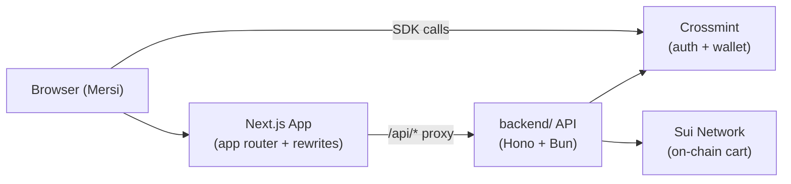

Mersi is a Next.js 16 AI shopping concierge (package name `purch`). Users describe what they want in plain English; the app streams responses from the `backend/` service, surfaces marketplace product results inside the chat, and takes the purchase from cart through Crossmint checkout to order confirmation.

## Tech Stack

| Layer | Library | Version |
|---|---|---|
| Framework | Next.js | 16.1.6 |
| UI | React | 19.2.3 |
| Styling | Tailwind CSS | ^4 |
| Client state | Zustand | ^5 |
| Server state | TanStack Query | ^5 |
| HTTP client | Ky | ^1 |
| Validation | Zod | ^4 |
| Auth + wallet | Crossmint SDK | ^3 |
| Sui blockchain | @mysten/sui, @mysten/payment-kit | ^2 / ^0.1 |
| Animation | Motion | ^12 |
| Icons | Lucide React | ^0.577 |

## Architecture

The app uses the Next.js App Router with two grouped layouts:

- `(auth)` — unauthenticated pages (`/login`, `/onboarding`). No `AuthGuard`.
- `(main)` — authenticated shell (`/app`). Wraps children with `AuthGuard`, `AppHeader`, `TabNav`, `CartSidebar`, `OrdersSidebar`, and `CartHydrator`.

All `/api/*` requests are proxied by Next.js rewrites to the `backend/` service (configured via `BACKEND_URL` or `NEXT_PUBLIC_API_URL` in `next.config.ts`).

## Pages

| Route | File | Description |
|---|---|---|
| `/` | `app/page.tsx` | Marketing landing page — feature sections, launch CTA |
| `/login` | `app/(auth)/login/page.tsx` | Crossmint email OTP + Google OAuth login |
| `/onboarding` | `app/(auth)/onboarding/page.tsx` | 3-step profile, address, and sizes form |
| `/app` | `app/(main)/app/page.tsx` | Full chat shell with sidebar session management |

## Quick Navigation

<Cards>
  <Card title="Pages & Routing" href="/frontend/pages">
    Route groups, layout composition, and the user journey from landing to the chat shell.
  </Card>
  <Card title="Chat Interface" href="/frontend/chat">
    SSE streaming architecture, message types, session management, and tool-result rendering.
  </Card>
  <Card title="Cart & Checkout" href="/frontend/cart-checkout">
    Zustand cart store, Crossmint checkout flow, and order status tracking.
  </Card>
  <Card title="State Management" href="/frontend/state">
    All Zustand stores, TanStack Query keys, the Ky client setup, and required env vars.
  </Card>
</Cards>
