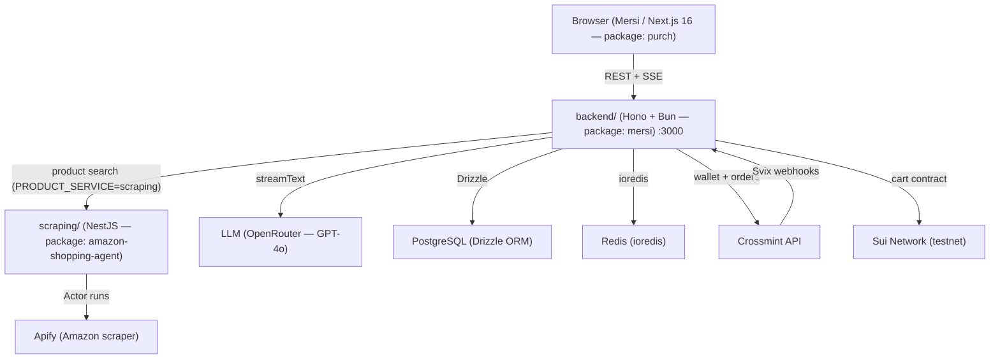

Mersi is a full-stack AI shopping platform. Users describe what they want in plain English; a ReAct agent searches live marketplace data, manages a cart (off-chain Redis or on-chain Sui smart contract), and processes payments through Crossmint — all from a single streaming chat interface.

## Repository Structure

```
sui_hackathon_1/
├── backend/        — Bun + Hono AI agent backend (package: mersi)
├── frontend/       — Next.js 16 + React 19 frontend (package: purch / branded "Mersi")
├── scraping/       — NestJS scraping + payments service (package: amazon-shopping-agent)
└── docs-site/      — This documentation site
```

## Platform Components

<Cards>
  <Card title="backend/ — AI Agent API" href="/architecture/services">
    Bun + Hono server. ReAct agent powered by OpenRouter (default: gpt-4o).
    Streams responses over SSE. Manages sessions, cart, checkout, and orders.
    Port 3000 by default.
  </Card>
  <Card title="frontend/ — Next.js App" href="/frontend">
    Next.js 16 + React 19 chat interface branded as "Mersi". Crossmint OTP
    login, chat window, product detail sheet, cart sidebar, and orders panel.
  </Card>
  <Card title="scraping/ — Search & Payments" href="/services">
    NestJS service. Apify-powered Amazon product scraping, Sui and
    Polkadot/Tempo payment guards, realtime search API.
  </Card>
</Cards>

## Architecture Overview



## Tech Stack

| Layer | Technology | Version |
| --- | --- | --- |
| Runtime (backend/) | Bun | 1.x |
| Framework (backend/) | Hono + `@hono/zod-openapi` | 4.x |
| AI | Vercel AI SDK + OpenRouter | 6.x |
| ORM | Drizzle + postgres.js | 0.38 |
| Effect / DI | Effect | 3.x |
| Blockchain | `@mysten/sui` | 2.15 |
| Auth / Wallet | `@crossmint/server-sdk` | 1.2 |
| Logging | Pino + BetterStack | 9.x |
| Frontend | Next.js | 16.1.6 |
| Frontend state | Zustand | 5.x |
| HTTP client | ky | 1.x |
| Scraping framework | NestJS | latest |
| Scraping / search | Apify client | 2.x |

## Quick Navigation

<Cards>
  <Card title="Quickstart" href="/getting-started/quickstart">
    Clone, configure, and run all three services in under 10 minutes.
  </Card>
  <Card title="API Reference" href="/api">
    Every backend/ endpoint with method, auth, request body, response, and curl
    examples.
  </Card>
  <Card title="Architecture" href="/architecture">
    Database schema, service layers, Effect dependency injection, and data flow
    diagrams.
  </Card>
  <Card title="Integrations" href="/integrations/crossmint">
    Crossmint wallet + payments and Sui blockchain cart contract details.
  </Card>
</Cards>
