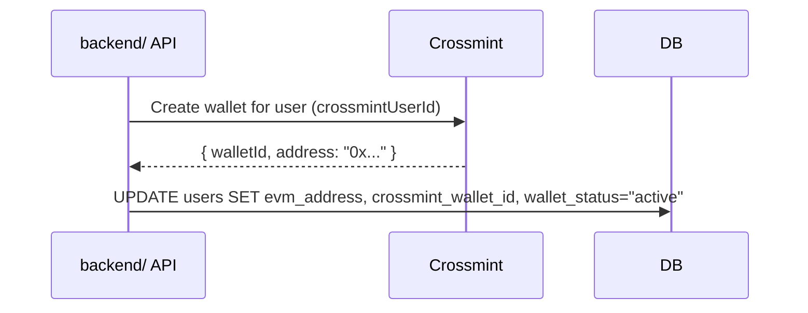
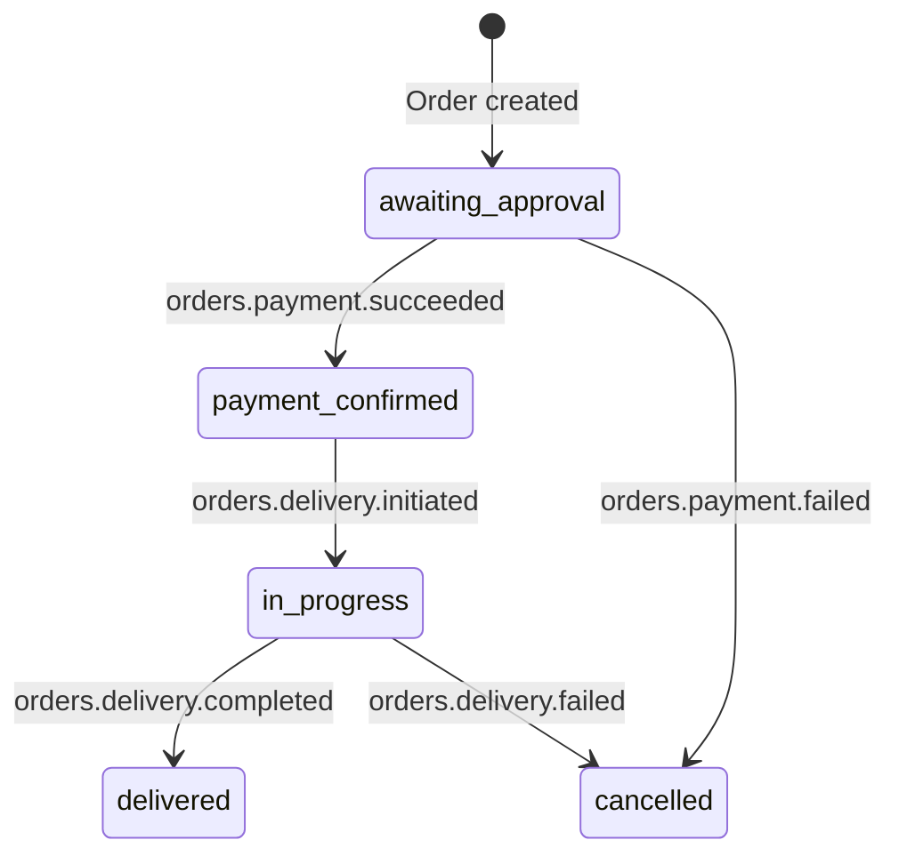

[Crossmint](https://crossmint.com) provides two capabilities in the `backend/` service:

1. **EVM wallet provisioning** — each user gets a non-custodial EVM wallet used for USDC payments
2. **Payment order creation** — Crossmint processes USDC payments and delivers physical goods

## Authentication

All Crossmint API calls use a server-side API key configured in `backend/`:

```env
CROSSMINT_SERVER_API_KEY=sk_staging_...   # staging
CROSSMINT_SERVER_API_KEY=sk_production_... # production
CROSSMINT_API_URL=https://staging.crossmint.com  # override API base URL (default: staging)
```

The frontend requires a separate **client** API key:
```env
NEXT_PUBLIC_CROSSMINT_API_KEY=pk_staging_...
```

## Wallet Provisioning

When a user completes authentication via the Crossmint OTP flow, the backend can provision an EVM wallet:



The EVM address is required for payment orders. Wallet status transitions: `none` → `pending` → `active` (or `failed`).

## Frontend Auth Provider

The frontend (`frontend/`) uses `@crossmint/client-sdk-react-ui` in `providers.tsx`:

```tsx
<CrossmintProvider apiKey={apiKey}>
  <CrossmintAuthProvider loginMethods={['email', 'google']} logoutRoute="/api/auth/logout">
    <CrossmintWalletProvider createOnLogin={{ chain: 'base-sepolia', signer: { type: 'email' } }}>
      ...
    </CrossmintWalletProvider>
  </CrossmintAuthProvider>
</CrossmintProvider>
```

After Crossmint OTP login, the frontend calls `POST /api/auth/session` with the JWT to exchange it for server-side session cookies.

## Payment Orders

Checkout creates a Crossmint **headless order** via the server SDK:

```typescript
const order = await crossmint.orders.create({
  payment: {
    method: env.CROSSMINT_EVM_CHAIN_TYPE,   // e.g. "base-sepolia"
    currency: "usdc",
    receiptEmail: user.email,
  },
  lineItems: [{
    productLocator: `${retailer}:${productId}`,
    callData: { /* Sui PTB parameters */ }
  }],
  recipient: {
    email: user.email,
    physicalAddress: { /* shipping address */ }
  }
})
```

The order ID is stored in `orders.crossmint_order_id` for webhook correlation.

## EVM Chain Configuration

Set `CROSSMINT_EVM_CHAIN_TYPE` to select the payment chain:

| Value | Network |
|---|---|
| `base-sepolia` | Base testnet (default) |
| `base` | Base mainnet |
| `ethereum-sepolia` | Ethereum testnet |
| `polygon` | Polygon mainnet |

## Webhook Events

Configure your webhook URL in the Crossmint dashboard under **Developers → Webhooks**:

```
https://your-domain.com/api/webhooks/crossmint
```

Set the signing secret in `backend/`:
```env
CROSSMINT_WEBHOOK_SECRET=whsec_...
```

### Event Lifecycle



### On-Chain Checkout Trigger

When `CART_SERVICE=onchain`, the backend automatically submits a Sui PTB on payment success and delivery completion:

1. Query order + cart item + user from DB
2. Build checkout PTB via `buildCheckoutTx(walletAddress, orderId, onChainObjectId)`
3. Submit via relayer (sponsored) or user key (if available)
4. Save Sui digest to `orders.tx_hash`

Idempotency is enforced: if `tx_hash` is already set, the PTB is skipped.

## SDK Usage

The backend uses `@crossmint/server-sdk`:

```typescript
import CrossmintSDK from "@crossmint/server-sdk"

const crossmint = CrossmintSDK({
  apiKey: env.CROSSMINT_SERVER_API_KEY,
  apiUrl: env.CROSSMINT_API_URL,
})
```

See `backend/src/lib/crossmint-client.ts` for the singleton instance.
