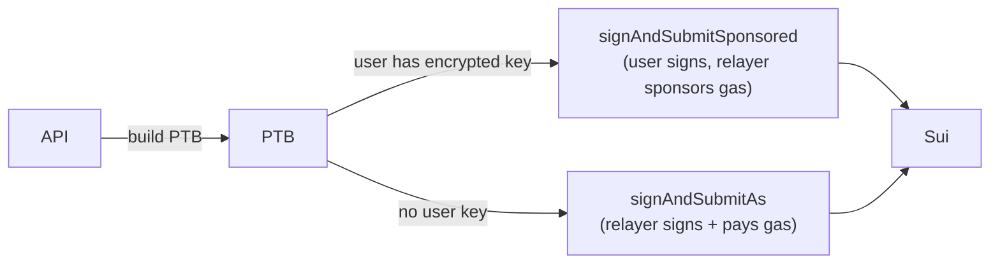

When `CART_SERVICE=onchain`, the cart is backed by a **Sui Move smart contract** instead of PostgreSQL/Redis. Cart items are objects on the Sui network, giving users provable ownership of their cart state.

## Configuration

Set these variables in `backend/`:

```env
CART_SERVICE=onchain
SUI_RPC_URL=https://fullnode.testnet.sui.io:443
SUI_CONTRACT_ADDRESS=0x<deployed-package-id>
SUI_CART_REGISTRY_ID=0x<shared-CartRegistry-object-id>
SUI_RELAYER_PRIVATE_KEY=suiprivkey1...
WALLET_ENCRYPTION_KEY=<32-byte-hex>
```

<Callout type="warn">
`SUI_CONTRACT_ADDRESS`, `SUI_CART_REGISTRY_ID`, and `SUI_RELAYER_PRIVATE_KEY` are required when `CART_SERVICE=onchain`. The server fails to start if any are missing (validated by Zod at startup).
</Callout>

## Contract Entry Points

The Move contract exposes these entry functions used by the backend:

| Function | Description | Called by |
|---|---|---|
| `init_cart(registry)` | Create a new `Cart` shared object for the user | `POST /api/cart/init` |
| `add_item(cart, registry, product_id, ...)` | Add an item object to the user's cart | `POST /api/cart` |
| `remove_item(cart, item_id)` | Remove an item from the cart | `DELETE /api/cart/:id` |
| `checkout(cart, order_id, item_id)` | Mark an item as purchased (records on-chain receipt) | Webhook handler |

## Transaction Building

The backend builds **Programmable Transaction Blocks (PTBs)** using `@mysten/sui`:

```typescript
import { Transaction } from "@mysten/sui/transactions"

export function buildCheckoutTx(
  ownerAddress: string,
  orderId: string,
  onChainItemId: string,
): Transaction {
  const tx = new Transaction()
  tx.moveCall({
    target: `${env.SUI_CONTRACT_ADDRESS}::cart::checkout`,
    arguments: [
      tx.object(env.SUI_CART_REGISTRY_ID),
      tx.pure.string(orderId),
      tx.object(onChainItemId),
    ],
  })
  tx.setSender(ownerAddress)
  return tx
}
```

See `backend/src/services/cart-onchain-service-live.ts` for all PTB builders.

## Relayer and Sponsored Transactions

The relayer signs and submits transactions on behalf of users:



**Key functions** in `backend/src/services/sui-relayer.ts`:

| Function | Description |
|---|---|
| `signAndSubmitAs(tx, keypair, idempotencyKey)` | Relayer signs and submits the PTB |
| `signAndSubmitSponsored(tx, userKeypair, idempotencyKey)` | User signs; relayer sponsors gas fees |

Transactions are wrapped in Effect for composable error handling.

## Keypair Management

User private keys are AES-encrypted at rest with `WALLET_ENCRYPTION_KEY`:

```typescript
// backend/src/lib/sui-client.ts
export function getUserKeypair(encryptedKey: string): Ed25519Keypair {
  const privateKey = decrypt(encryptedKey, env.WALLET_ENCRYPTION_KEY)
  return Ed25519Keypair.fromSecretKey(fromB64(privateKey))
}

export function getRelayerKeypair(): Ed25519Keypair {
  return Ed25519Keypair.fromSecretKey(
    decodeSuiPrivateKey(env.SUI_RELAYER_PRIVATE_KEY).secretKey
  )
}
```

## On-Chain Event Indexer

When `SUI_CONTRACT_ADDRESS` is set, an event indexer starts automatically at server boot:

```typescript
// backend/src/index.ts
if (env.SUI_CONTRACT_ADDRESS) {
  startIndexer()
}
```

The indexer subscribes to contract events and syncs them to PostgreSQL:

| Event | Action |
|---|---|
| `CartItemAdded` | Upsert `cart_items` row with `on_chain_object_id` |
| `CartItemRemoved` | Set `cart_items.deleted_at` |
| `OrderCreated` | Update `orders.tx_hash` |

This keeps the local DB in sync with on-chain state, enabling the REST API to serve cart data without live RPC calls on every request.

## USDC Deposit Integration

The `backend/` also integrates Sui USDC deposits via `POST /api/deposit/verify`. This uses `@mysten/payment-kit` on the frontend to construct the deposit transaction, then verifies the on-chain `PaymentReceipt` event server-side before crediting the Crossmint EVM wallet.

See [Deposit API](/api/deposit) for the full flow.

## Testnet Setup

To deploy and initialize the contract on Sui testnet:

```bash
# Deploy the contract
sui client publish --gas-budget 100000000

# Save the deployed package ID to backend/.env
SUI_CONTRACT_ADDRESS=0x<package-id>
SUI_CART_REGISTRY_ID=0x<registry-shared-object-id>
```
