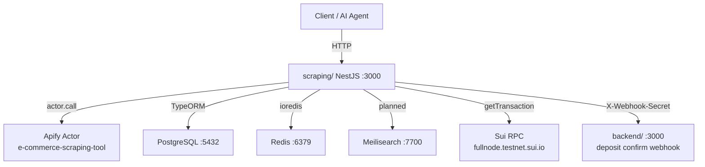

The `scraping/` service is a **NestJS 10** application (package name `amazon-shopping-agent`) built primarily as an **Amazon product search service**. It provides two capabilities:

- **Real-time product search** — builds a native Amazon search URL from the user's query, runs the Apify `apify/e-commerce-scraping-tool` actor against it, normalises the scraped results, and returns a ranked product list.
- **Sui payment verification** — verifies on-chain Sui transactions and forwards deposit confirmation events to the `backend/` service.

All routes are served under the `/api` prefix. Port defaults to `3000` (override with `PORT` env var). The search endpoint is publicly accessible.

## Tech Stack

| Layer | Technology |
|-------|-----------|
| Framework | NestJS 10 / Express |
| Language | TypeScript 5 |
| Database | PostgreSQL 15 (TypeORM) |
| Cache / Locks | Redis 7 (ioredis) |
| Search | Meilisearch v1.5 (provisioned, not yet used) |
| Web scraping | Apify `apify/e-commerce-scraping-tool` actor |
| Sui payments | `@mysten/sui` |
| Validation | `class-validator` / `class-transformer` |
| Rate limiting | `@nestjs/throttler` |
| API docs | `@nestjs/swagger` (Swagger UI at `/api-docs`) |

## Infrastructure



## Module Catalog

| Module | Routes | Purpose |
|--------|--------|---------|
| `RealtimeSearchModule` | `GET /api/search/realtime`, `GET /api/search/realtime/product/:asin` | Apify scraping + product normalisation |
| `PaymentModule` | `POST /api/payment/verify`, `GET /api/payment/transaction/:txHash`, `GET /api/payment/:id` | Sui TX verification + deposit forwarding |
| `SuiModule` | internal | Sui RPC client used by PaymentModule |
| `NormalizationModule` | internal | Flatten and validate Apify product payloads |
| `DatabaseModule` | internal | TypeORM data sources, entities, migrations |

## Quick Start

```bash
cd scraping

# Copy and fill environment variables
cp .env.example .env

# Start all services
docker compose up -d

# App is available at http://localhost:3000
```

The compose stack starts the NestJS app, PostgreSQL, Redis, and Meilisearch. See [Environment Reference](/services/environment) for every variable.

<Callout type="info">
  The NestJS app waits for PostgreSQL, Redis, and Meilisearch to pass their health checks before accepting traffic.
</Callout>

<Cards>
  <Card title="Search & Scraping" href="/services/scraping" description="How the Apify actor call, normalisation pipeline, and search endpoint work." />
  <Card title="Payments" href="/services/payments" description="Sui transaction verification and deposit forwarding." />
</Cards>
